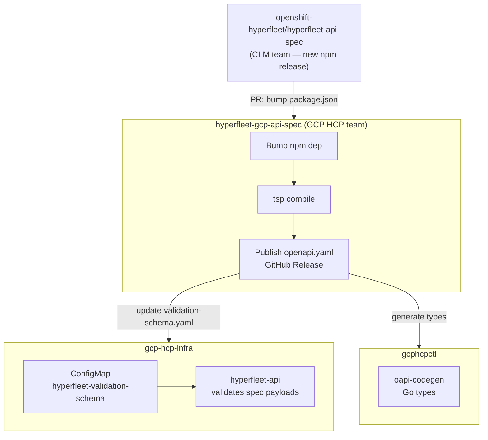

# GCP-836 Spike Findings: GCP Spec Composition with Core HyperFleet Spec

**Date:** 2026-06-17
**Author:** Cristiano Veiga

---

## Summary

This spike investigated the mechanics of the npm-based TypeSpec composition pattern from `hyperfleet-api-spec-template` — specifically how the GCP-specific `ClusterSpec`/`NodePoolSpec` definitions compose with the core CLM spec, and how the resulting `openapi.yaml` is consumed for API validation and Go type generation. Both use cases are well understood and the implementation path for `openshift-online/hyperfleet-gcp-api-spec` (GCP-833) is clear.

---

## How the Composition Works

The CLM team owns the API surface — routes, pagination, status models — defined in the `hyperfleet` npm package (`github.com/openshift-hyperfleet/hyperfleet-api-spec`). GCP HCP is responsible for defining what goes inside the `spec` field of cluster and nodepool resources. This split is intentional: the npm package references `ClusterSpec` and `NodePoolSpec` in its route definitions (e.g. `ClusterBase.spec: ClusterSpec`) but deliberately leaves those types undefined, exposing them as provider extension points.

The provider repo (`hyperfleet-gcp-api-spec`) defines `ClusterSpec` and `NodePoolSpec` locally in TypeSpec. When `tsp compile` runs, the compiler resolves the cross-package references and produces a **single self-contained `openapi.yaml`** that contains all CLM routes and the GCP-specific schemas merged under `components.schemas`. No runtime merging is required.

The generated `openapi.yaml` serves two purposes from a single source of truth:

- **API validation** — mounted as a Kubernetes ConfigMap and referenced by `validationSchema.existingConfigMap` in the hyperfleet-api Helm chart; the API rejects invalid `spec` payloads at the HTTP middleware layer
- **CLI type generation** — consumed by `oapi-codegen` in `gcphcpctl` to generate typed Go structs; the npm package also ships a `go.mod`, establishing the `go list -m` consumption pattern already used upstream

---

## Keeping in Sync with Upstream



**Sync trigger:** When CLM releases a new version of `hyperfleet-api-spec`, the GCP HCP team opens a PR to `hyperfleet-gcp-api-spec` bumping the npm dependency. CI re-runs `tsp compile` to validate the build still passes (catching any breaking changes in the core spec early). On merge, a new `openapi.yaml` artifact is published and consumers are updated.

---

## Verification 1: API Validation ✅

**Goal:** Validate that the generated spec is sufficient for HyperFleet API validation.

**Result:** Confirmed end-to-end in the `dev-cveiga` environment.

The generated `openapi.yaml` was:
1. Embedded into a Kubernetes ConfigMap (`hyperfleet-validation-schema`) via `helm/charts/hyperfleet-cloud-resources`
2. Mounted into the `hyperfleet-api` pod at `/etc/hyperfleet/validation-schema/openapi.yaml`
3. Picked up via `validationSchema.existingConfigMap: hyperfleet-validation-schema` in the upstream chart

Startup log confirmed:
```
"message": "Schema validation enabled",
"schema_path": "/etc/hyperfleet/validation-schema/openapi.yaml"
```

**Validation behaviour verified:**

| Request | Result |
|---|---|
| `POST /clusters` missing `platform.gcp` | `400 HYPERFLEET-VAL-000` — `spec.platform.gcp: property "gcp" is missing` |
| `POST /clusters` with valid GCP spec | `201 Created` |

---

## Verification 2: Go Type Generation ✅

**Goal:** Validate that the generated spec is sufficient for `gcphcpctl` Go type generation.

**Result:** Confirmed. `oapi-codegen --generate=types` produces clean, idiomatic Go structs from the merged schema. Output compiles without errors.

**Command used:**
```bash
oapi-codegen \
  --package=gcp \
  --generate=types \
  --o spike-output/types.go \
  schemas/template/openapi.yaml
```

**Key generated types:**

```go
type ClusterSpec struct {
    Dns        *DNSSpec            `json:"dns,omitempty"`
    InfraID    *string             `json:"infraID,omitempty"`
    IssuerURL  *string             `json:"issuerURL,omitempty"`
    Networking *NetworkingSpec     `json:"networking,omitempty"`
    Platform   ClusterPlatformSpec `json:"platform"`
    Release    *ReleaseSpec        `json:"release,omitempty"`
}

type ClusterPlatformSpec struct {
    Gcp  ClusterPlatform         `json:"gcp"`
    Type ClusterPlatformSpecType `json:"type"`
}

type ClusterPlatform struct {
    EndpointAccess   *EndpointAccess       `json:"endpointAccess,omitempty"`
    Network          *string               `json:"network,omitempty"`
    ProjectID        *string               `json:"projectID,omitempty"`
    Region           *string               `json:"region,omitempty"`
    Subnet           *string               `json:"subnet,omitempty"`
    WorkloadIdentity *WorkloadIdentitySpec `json:"workloadIdentity,omitempty"`
}

type WorkloadIdentitySpec struct {
    PoolID             *string             `json:"poolID,omitempty"`
    ProjectNumber      *string             `json:"projectNumber,omitempty"`
    ProviderID         *string             `json:"providerID,omitempty"`
    ServiceAccountsRef *ServiceAccountsRef `json:"serviceAccountsRef,omitempty"`
}

type EndpointAccess string
const (
    Private          EndpointAccess = "Private"
    Public           EndpointAccess = "Public"
    PublicAndPrivate EndpointAccess = "PublicAndPrivate"
)
```

The generated file is at `spike-output/types.go` for reference.

**Integration in `gcp-hcp-ctl`:**

The generated files live under `pkg/hyperfleet/` and are committed to the repo so it compiles without requiring the spec repo checked out locally. A thin hand-written `hyperfleet.go` wires ADC auth into the generated client via `WithRequestEditorFn`. Regeneration is driven by `make generate`:

```
pkg/hyperfleet/
  types.gen.go    — generated types (committed)
  client.gen.go   — generated HTTP client (committed)
  hyperfleet.go   — hand-written ADC auth wrapper
```

A stub `cluster create` command was built and validated end-to-end against the live `dev-cveiga` API:

```bash
export HYPERFLEET_API_URL="https://hyperfleet-api-us-central1-cveigaf607.dev.gcp-hcp.devshift.net"
gcphcpctl cluster create --name poc-test-cluster --project-id cveiga-gcp-hcp-2 --region us-central1
# NAME              CREATED
# poc-test-cluster  2026-06-18 12:11:45 +0000 UTC
```

Branch: https://github.com/cristianoveiga/gcp-hcp-ctl/tree/feat/GCP-627-hyperfleet-api-types-poc

---

## Impact on GCP-833

The following implementation details are confirmed for GCP-833:

1. Fork `hyperfleet-api-spec-template` → `openshift-online/hyperfleet-gcp-api-spec`
2. Replace `models/cluster/model.tsp` and `models/nodepool/model.tsp` with GCP-specific definitions (already authored on branch `feat/GCP-836-gcp-cluster-spec`)
3. CI: `tsp compile` on every PR to validate schema builds and catch upstream breaking changes early
4. Publish `schemas/template/openapi.yaml` as a GitHub Release artifact for consumption by `gcp-hcp-infra` and `gcphcpctl`
5. The `go.mod` in `node_modules/hyperfleet/` confirms the `go list -m` consumption pattern for `gcphcpctl` is already established upstream

---

## Artefacts

| Artefact | Location |
|---|---|
| GCP TypeSpec model | https://github.com/cristianoveiga/hyperfleet-api-spec-template/tree/feat/GCP-836-gcp-cluster-spec |
| Generated `openapi.yaml` | https://github.com/cristianoveiga/hyperfleet-api-spec-template/blob/feat/GCP-836-gcp-cluster-spec/schemas/template/openapi.yaml |
| Generated Go types | https://github.com/cristianoveiga/gcp-hcp-ctl/blob/feat/GCP-627-hyperfleet-api-types-poc/pkg/hyperfleet/types.gen.go |
| Deployed ConfigMap | `hyperfleet-validation-schema` in `hyperfleet` ns, `dev-cveiga` region cluster |
| Live validation endpoint | `https://hyperfleet-api-us-central1-cveigaf607.dev.gcp-hcp.devshift.net` |
| CLI POC | https://github.com/cristianoveiga/gcp-hcp-ctl/tree/feat/GCP-627-hyperfleet-api-types-poc |
